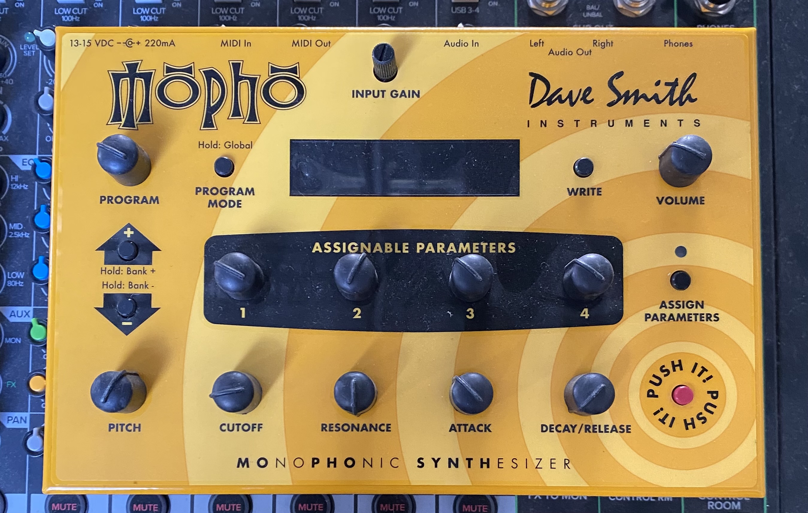
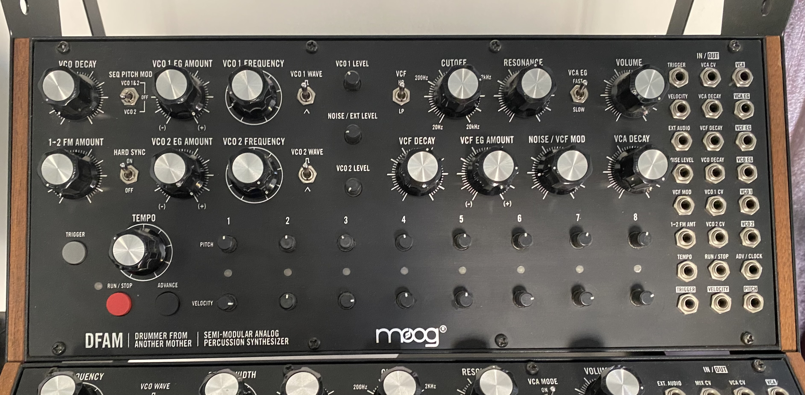
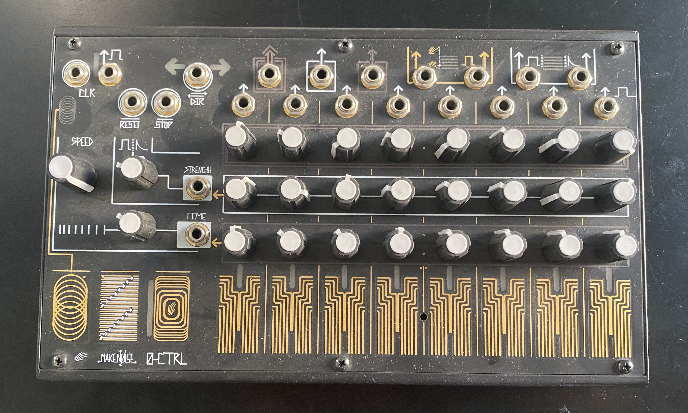
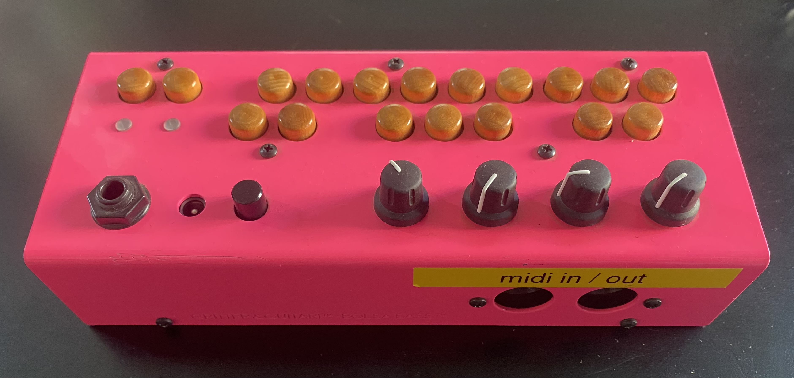
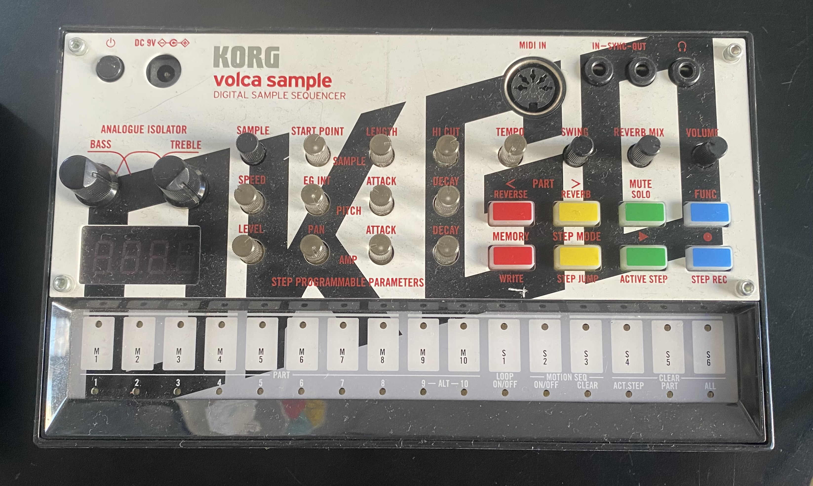
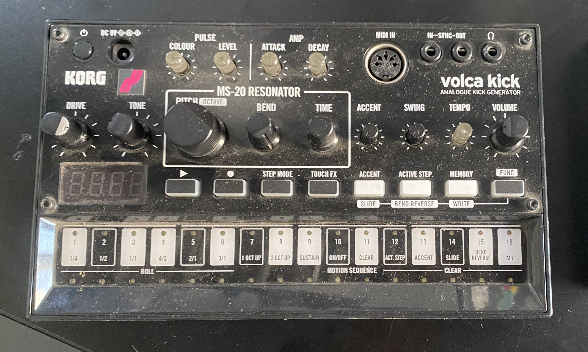

# Catalogo de instrumentos

Creo que sería pertinente incluir el nombre del instrumento con una descripción al costado, detallando los tipos de sonidos que se pueden lograr. Estas descripciones no solo las tengo que investigar, sino que debería ver videos y reseñas para profundizar en las características propias del instrumento.

Además, sería útil tener una tabla con el nombre del modelo, marca, voltaje y salidas.

## Definición

En sintetizadores, controladores y secuenciadores

descropción, tabla con datos, recursos y foto

## Sintetizadores 

que son los sintetizadores...

### Dave Smith Instruments Mopho

Sintetizador monofónico analógico 

### Grandmother

Sintetizador semimodular analógico Moog

### Minilogue

Sintetizador polifonico analógico de Korg

### Mother-32

Sintetizador semimodular analógico de Moog

### DFMA

Sintetizador semimodular de percutoción analógico de Moog

## Controladores

que son los controladores...

### Minilab 3

Controlador MIDI de Arturia

https://www.arturia.com/es/products/hybrid-synths/minilab-3/overview

## Secuenciadores

*por definiiiir*

