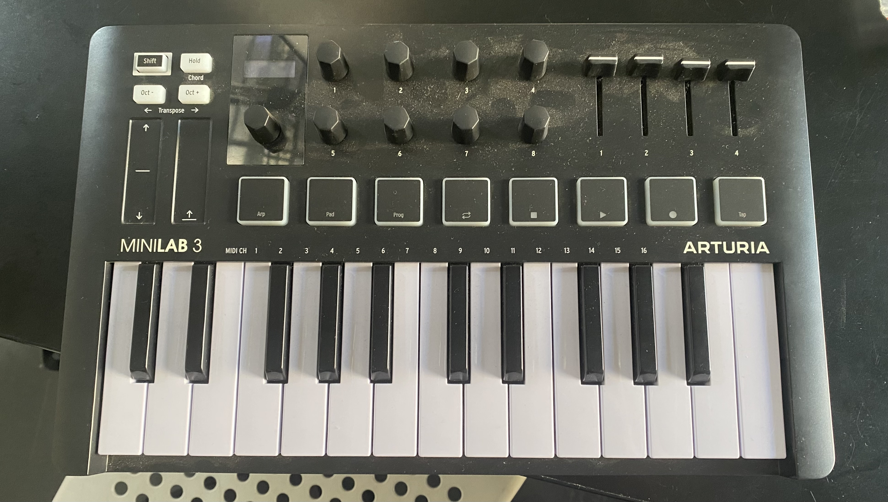
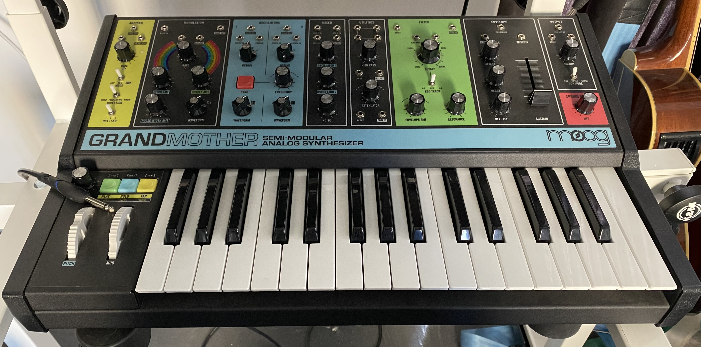
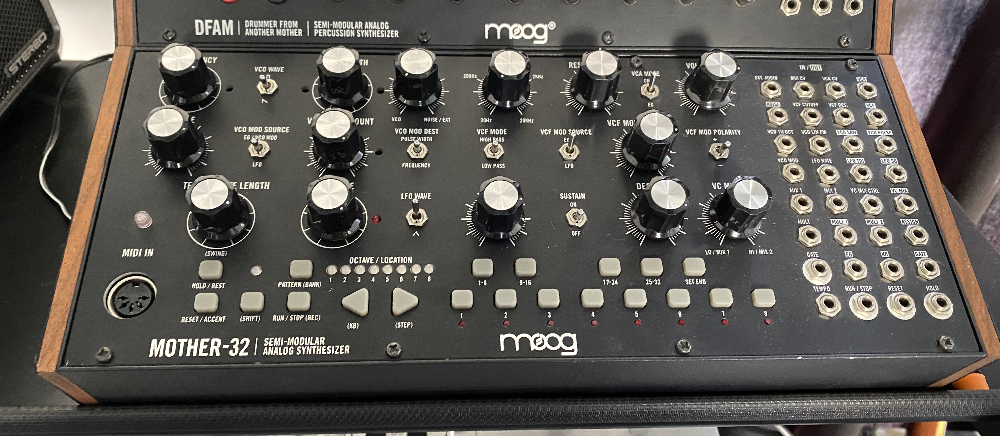
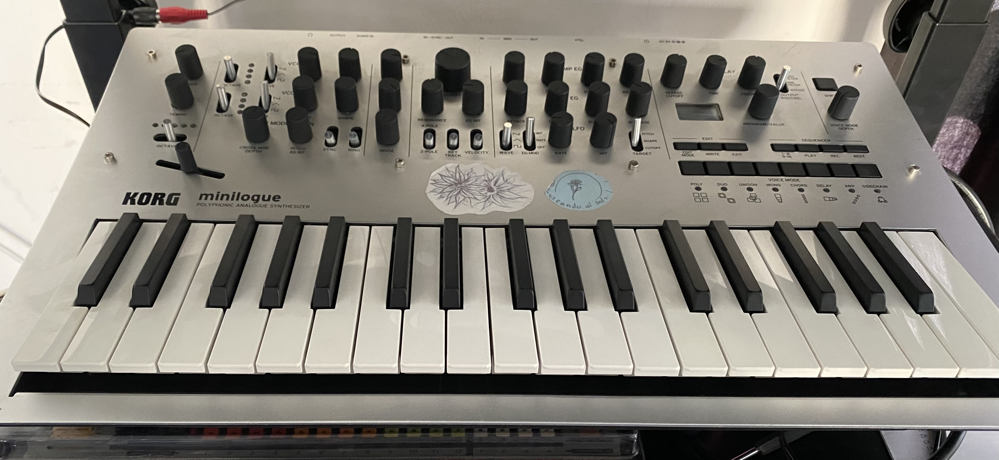
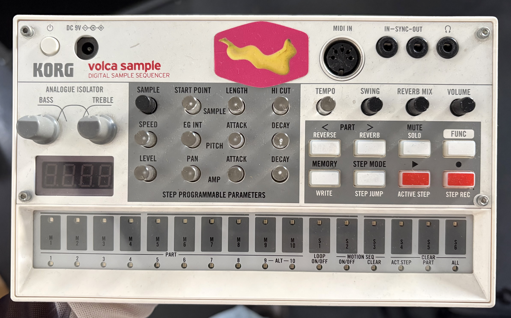
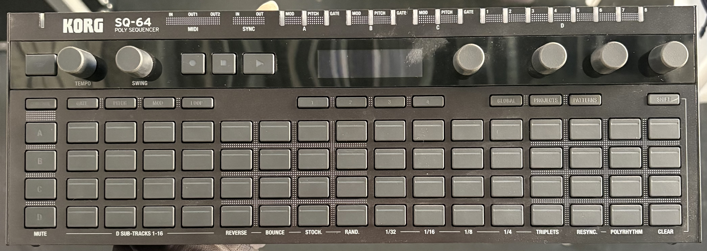
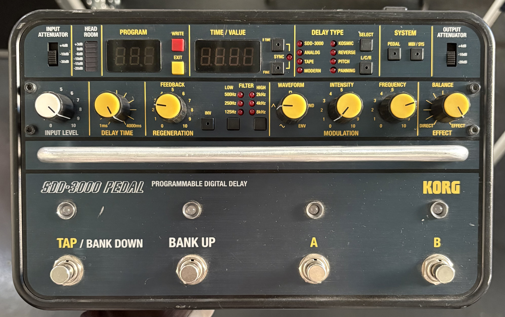
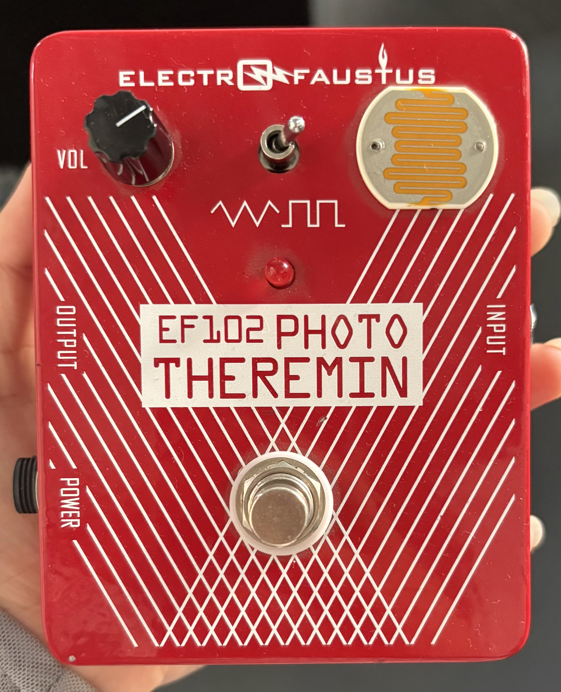
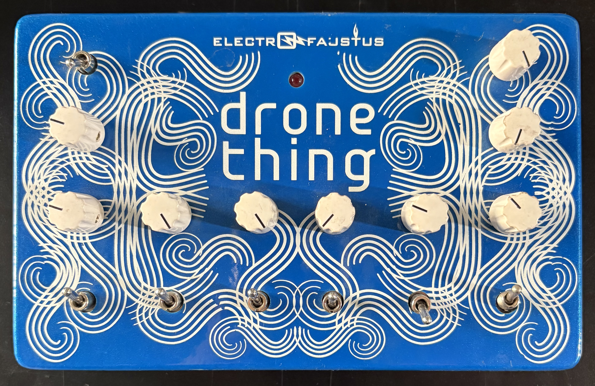
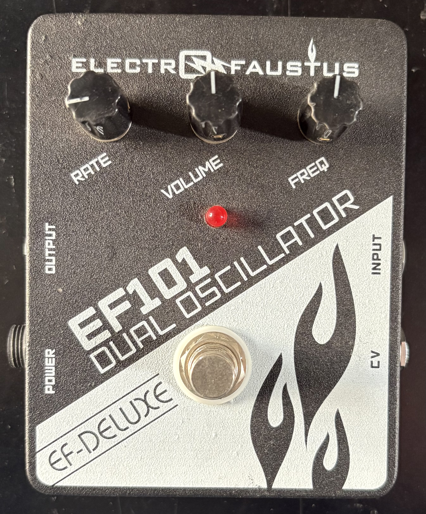

# Catalogo de instrumentos

Creo que sería pertinente incluir el nombre del instrumento con una descripción al costado, detallando los tipos de sonidos que se pueden lograr. Estas descripciones no solo las tengo que investigar, sino que debería ver videos y reseñas para profundizar en las características propias del instrumento.

Además, sería útil tener una tabla con el nombre del modelo, marca, voltaje y salidas.

## Definición

En sintetizadores, controladores y secuenciadores

descropción, tabla con datos, recursos y foto

## Sintetizadores 

que son los sintetizadores...

### Asturia

### Dave Smith Instruments 

Mopho: Sintetizador monofónico analógico 

### Moog

Grandmother: Sintetizador semimodular analógico

Mother-32: Sintetizador semimodular analógico de Moog

DFMA: Sintetizador semimodular de percutoción analógico de Moog

Subharmonicon: 

### Korg

Minilogue: Sintetizador polifonico analógico

Volca sample: Secuenciador sample digital

https://www.korg.com/cl/products/dj/volca_sample/index.php

Volca sample: Secuenciador sample digital

https://www.korg.com/cl/products/dj/volca_sample/index.php

Volca Kick: Generador de bombo analógico de Korg

https://www.korg.com/cl/products/dj/volca_kick/

SQ-64: Secuenciador, polifonico

### Arturia

Minilab 3: Controlador MIDI

https://www.arturia.com/es/products/hybrid-synths/minilab-3/overview

### Make Noise

0-CTRL: Controlador y secuenciador

https://www.makenoisemusic.com/synthesizers-and-controllers/0-ctrl/

### Dave smith instruments

### electro-faustus-01.jpeg

## POR DEFINIIIR

en el codigo de la pagina web

  - id: 1
    marca: "Moog"
    modelo: "Subharmonicon"
    categorias: ["sintetizador", "analógico", "semimodular", "polirítmico"]
    enlaces: ["https://www.moogmusic.com/synthesizers/subharmonicon/"]
    imagenes: ["moog-01.jpeg"]

  - id: 2
    marca: "Korg"
    modelo: "Minilogue"
    categorias: ["sintetizador", "polifónico", "analógico"]
    enlaces: [""]
    imagenes: ["korg-01.jpeg"]

  - id: 3
    marca: "Dave Smith Instruments"
    modelo: "Mopho"
    categorias: ["sintetizador", "monofónico", "analógico"]
    enlaces: [""]
    imagenes: ["dave-smith-instruments-01.jpeg"]

  - id: 4
    marca: "Moog"
    modelo: "Mother-32"
    categorias: ["sintetizador", "semimodular", "analógico"]
    enlaces: [""]
    imagenes: ["moog-02.jpeg"]

  - id: 5
    marca: "Moog"
    modelo: "DFMA"
    categorias: ["sintetizador", "semimodular", "percutoción", "analógico"]
    enlaces: [""]
    imagenes: ["moog-03.jpeg"]

  - id: 0
    marca: ""
    modelo: ""
    categorias: ["sintetizador", "semimodular", "percutoción", "analógico", "monofónico", "polifónico", "polirítmico"]
    enlaces: [""]
    imagenes: [""]

  - id: 0
    marca: ""
    modelo: ""
    categorias: ["sintetizador", "semimodular", "percutoción", "analógico", "monofónico", "polifónico", "polirítmico"]
    enlaces: [""]
    imagenes: [""]

  - id: 0
    marca: ""
    modelo: ""
    categorias: ["sintetizador", "semimodular", "percutoción", "analógico", "monofónico", "polifónico", "polirítmico"]
    enlaces: [""]
    imagenes: [""]

  - id: 0
    marca: ""
    modelo: ""
    categorias: ["sintetizador", "semimodular", "percutoción", "analógico", "monofónico", "polifónico", "polirítmico"]
    enlaces: [""]
    imagenes: [""]

  - id: 0
    marca: ""
    modelo: ""
    categorias: ["sintetizador", "semimodular", "percutoción", "analógico", "monofónico", "polifónico", "polirítmico"]
    enlaces: [""]
    imagenes: [""]

