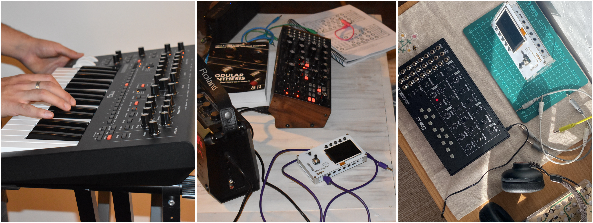
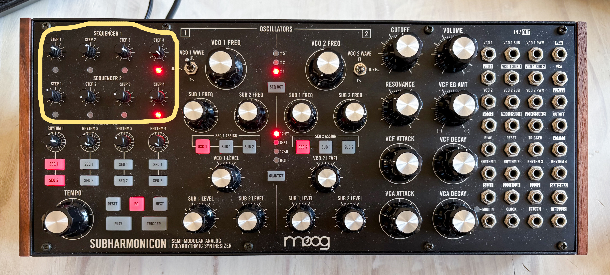
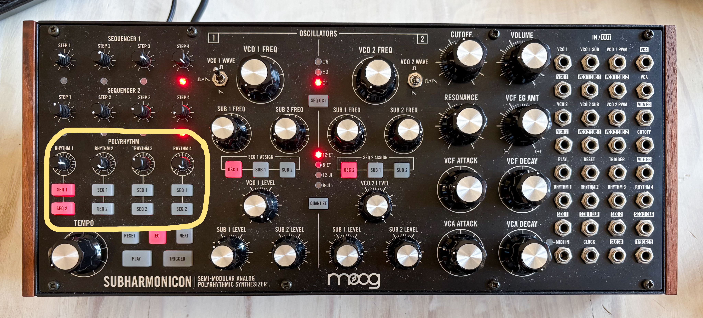
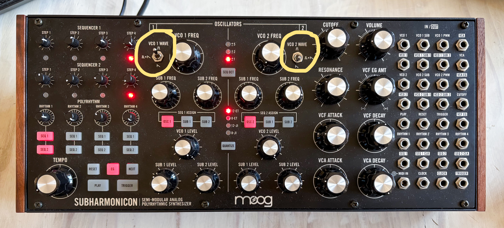
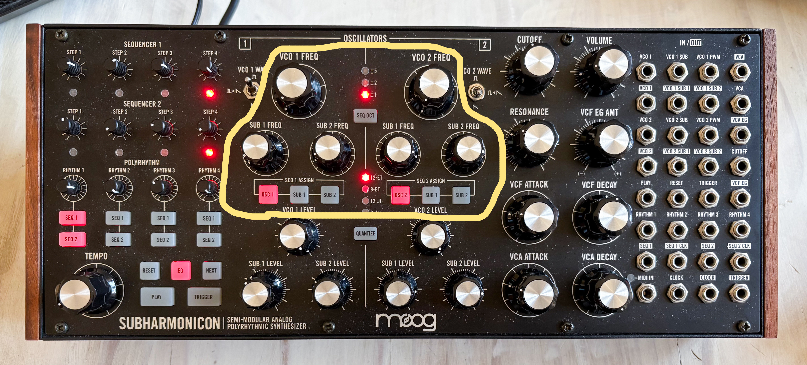
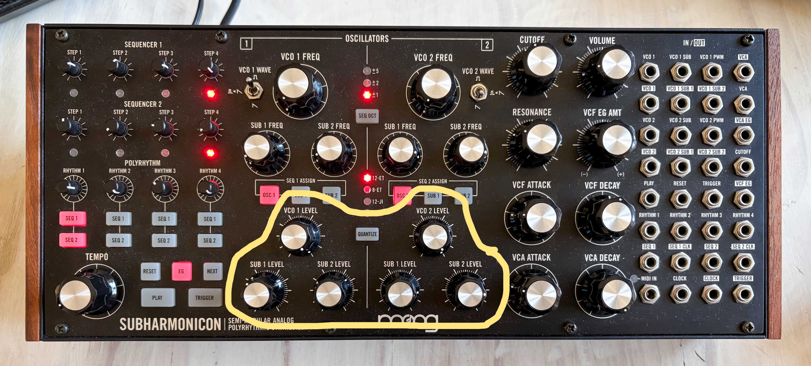
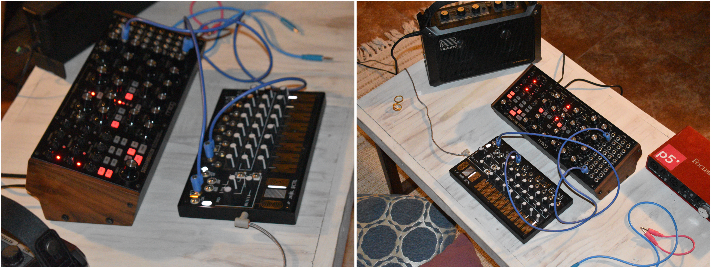

# Guía de mi aprendizaje con los sintetizadores

Apuntes en proceso de registro de mi investigación sobre lo que considero necesario comprender y expresar.

Como contexto, provengo de la disciplina del diseño industrial. Los sintetizadores han sido lo más cercano que he estado realmente al mundo del arte sonoro. Esta pasión llegó en un momento en que necesitaba conectar con algo que me acompañara y me ayudara a entenderme. La adopté como un acto de resistencia, un espacio donde podía crear y escuchar con atención cosas de mí misma.

## ¿Qué es un sintetizador?

Un sinte es un instrumento electrónico que genera, procesa y modifica señales eléctricas a través de módulos para convertirlas en sonido.

Primero que nada, me parece sensato expresar que los sintetizadores tienen muchísimas funciones, puede llegar a ser agobiante comprender la profundidad de su funcionamiento, pero no es necesario comprenderlo todo para disfrutar y jugar con un sinte.

### Rutas de conexión

Los sintetizadores son máquinas que modifican señales, en un comienzo, todos eran modulares. Esto quiere decir que las funciones con las que podían alterar estas señales, como el oscilador, el filtro o el amplificador, existían en módulos independientes que debían conectarse mediante cables.

Esto permite personalización y control de cada componente, creando rutas de señal. Actualmente, estas conexiones también pueden estar preestablecidas, como ocurre en los sintetizadores de arquitectura fija, que cuentan con un cableado integrado.

Por último, también existen los sintetizadores semimodulares, que poseen rutas de conexión preestablecidas e integradas, pero además incluyen un patch panel, que es un panel de conexiones que permite utilizar cables para modificar estas rutas y crear diversos resultados.

Entonces, como mencioné, existen tres tipos principales: los modulares, los de arquitectura fija (o tradicionales) y los semimodulares.

### Analógico o Digital

Tenemos lo que son las señales analógicas y las señales digitales, entendiendo las señales como información que se traslada.

Las señales analógicas varían de manera continua y pueden tomar infinitos valores dentro de un rango. En cambio, las señales digitales están compuestas por valores definidos, representados mediante números, por lo que la información se almacena y procesa en pasos específicos.

A partir de esta diferencia, un sintetizador analógico genera y procesa el sonido mediante circuitos electrónicos que trabajan con señales continuas. Por otro lado, un sintetizador digital genera y procesa el sonido mediante cálculos realizados por un procesador, representando la señal como información digital.

### Monofónico y Polifónico

---

## Principales módulos y sus funciones

### Osciladores

### Filtros

### Emvolventes ADSR

A: Attack, cuánto demora el sonido en llegar a su punto máximo.

D: Decay, qué pasa con ese sonido hasta el sostenimiento.

S: Sustain, qué pasa luego de decaer, mientras se presione la nota, en lo que se mantiene.

R: Release, qué pasa después de soltar la nota.

### LFO

El LFO es el oscilador de baja frecuencia, utilizado para modular parámetros en el sonido, creando efectos o vibratos.

VCO: Oscilador controlado por voltaje.

VCF: Filtro controlado por voltaje.

VCA: Amplificador controlado por voltaje.

---

## Mi aprendizaje con el Subharmonicon

### Cómo llegué a utilizar el Subharmonicon

El primer semestre de 2025 tomé el taller Diseño de Máquinas Electrónicas, en donde todo este universo de la electrónica se me hizo fascinante. Comencé a ir mucho más al Laboratorio de Interacción Digital, en donde me encontré, en una de estas ocasiones, con Aarón utilizando un sinte. Él estaba utilizando un tríptico de sintes modulares Moog. Ahí le pedí si me podía enseñar a utilizarlos, y me mostró unos sonidos que me dejaron encantada.

Recuerdo que hablamos de que me gustaba escuchar música tranquila y me dijo que utilizara el Subharmonicon, ya que es un sinte con armónicos muy interesantes. Desde ahí aprendí a encenderlo y conectarlo al adaptador y al amplificador, e iba al laboratorio a utilizarlo cuando no estaba en clases.

No podría decir que entendía lo que hacía; solo me gustaba hacer sonidos, filtrar los agudos y escuchar cómo se repetían. Como mencioné, para mí esto fue una manera de mantenerme distraída y acompañada durante ese semestre.

Ahora, en el primer semestre de 2026, junto con la práctica electiva, pedí prestado al Laboratorio de Interacción Digital el Subharmonicon. No era la primera vez que me había llevado un sinte; también me había llevado el Moog Mavis, el cual, supongo que por la falta de secuenciador, no me terminó de encantar y lo devolví, ya que me agobié por mi falta de conocimiento.

---

### Secuenciadores

El Subharmonicon tiene dos secuenciadores de cuatro pasos. Son cuatro perillas las cuales conforman el orden, o las notas que van a sonar. La secuencia 1 corresponde al oscilador 1 y la secuencia 2 corresponde al oscilador 2.

### Polirritmos

Justo abajo de las secuencias se encuentran los polirritmos. Estos ritmos corresponden a la velocidad en la que se va a reproducir esta frecuencia; es el tiempo específico para cierta secuencia. Se le pueden determinar a la secuencia 1 o a la secuencia 2, o incluso a ambas.

### Tempo

Los ritmos están regidos por el tempo, que es el tiempo general del sintetizador, ya que los ritmos son divisiones que se van escalando de manera proporcional entre sí.

### Osciladores

Los osciladores son lo que produce y comienza el sonido. Estos tienen formas de onda, VCO 1 WAVE y VCO 2 WAVE, que es el tipo de señal que va a producir el oscilador. La de arriba es una onda cuadrada, abajo es una onda diente de sierra y, por último, en medio incluye un modo híbrido donde se asigna una onda cuadrada al oscilador y ondas de diente de sierra a los subarmónicos.

Los osciladores tienen frecuencias: VCO 1 FREQ y VCO 2 FREQ. VCO quiere decir Voltage Controlled Oscillator / Oscilador controlado por voltaje. Esto controla los agudos o graves, es la cantidad de frecuencias por segundo. 

También tenemos las subfrecuencias, SUB 1 FREQ y SUB 2 FREQ, que son como divisiones deL sonido del oscilador, para crear armónicos. Estas perillas controlan la distancia con el oscilador. 

Abajo están el VCO 1 LEVEL y VCO 2 LEVEL, que controlan el volumen con el que van a sonar los osciladores. También están el SUB 1 LEVEL y SUB 2 LEVEL, que controlan el volumen con el que van a sonar las sub frecuencias.

### Juego con el sinte

Generalmente, lo que hago yo es crear una secuencia en escala ascendente o descendente con la secuencia 1, a la que le doy una frecuencia un poco aguda, y crear con la secuencia 2 una repetitiva, más plana, y darle una frecuencia grave. Utilizo el ritmo 1 con la secuencia 1, con la perilla en la mitad, y el ritmo 2 con la secuencia 2, con la perilla al máximo.

Por el momento, no he utilizado mucho las subfrecuencias, ya que recién logré comprender esta primera parte del sintetizador.

ESCRIBIR EL SIGUIENTE PASO DE APRENDIZAJE CON EL SECUENCIADOR Y LA INTERFAZ

