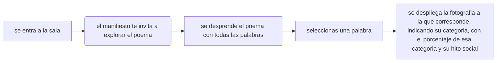

# Taller Visualizacion de Datos

## Manifiesto Hitos Sociales

Las palabras también son datos.

Cada una de ellas fue escrita por alguien, en un momento de incertidumbre, conflicto o transformación. Reunidas, dejan de pertenecer a una sola voz y comienzan a construir una memoria colectiva.

Este poema procedural no busca narrar una historia, sino revelar los temas que atravesaron el estallido social y la pandemia a partir de las palabras que las personas compartieron en redes sociales.

Explora el poema. Descubre el origen de cada palabra y las relaciones ocultas entre los datos, las imágenes y sus clasificaciones.

**¿Qué hicimos?**

Recopilamos y analizamos publicaciones de Instagram, Facebook y TikTok relacionadas con el estallido social y la pandemia. A partir de los textos presentes en las imágenes, generamos un poema procedural compuesto por las palabras extraídas y desarrollamos una instalación interactiva para responder la pregunta: ¿Cuáles fueron los principales temas expresados en las redes sociales durante el estallido social y la pandemia?

**¿Por qué lo hicimos?**

Utilizamos el recurso de la poesía procedural porque permite construir un poema a partir de reglas y datos, en lugar de una escritura subjetiva. De esta forma, el poema surge de las palabras recopiladas en las publicaciones, reuniendo múltiples voces y formas de expresión sin intervenir su contenido. Esto convierte los datos en una experiencia interactiva que evidencia las temáticas presentes durante ambos hitos sociales.

**¿Cómo lo hicimos?**

Realizamos una búsqueda manual de publicaciones, filtramos las imágenes que contenían texto, extrajimos y clasificamos las palabras con apoyo de inteligencia artificial, organizamos la información en una base de datos y desarrollamos una aplicación web con p5.js, donde cada palabra del poema permite acceder a su fotografía, frase de origen, temática y porcentaje de aparición.

## Láminas taller data presentación

### ADQUIRIR: DÓNDE MIRO

- busco en los 40 perfiles fotos de hitos nacionales, esta búsqueda es dentro de instagram, facebook y tiktok

- definimos cuatro hitos sociales más importantes, revolucion pinguina, terremoto, estallido social y pandemia.

- Recopilamos mediante búsqueda manual en un tiempo determinado de un año de hito todas sus fotos.

- no encontramos publicaciones en las fechas de revolucion pinguina, ni terremoto por lo que descartoamos estos hitos sociales

**hitos y fechas de búsqueda**

- **Revolución Pingüina**: 1 de enero de 2006 – 1 de enero de 2007

- **Terremoto:** 27 de febrero de 2010 – 27 de febrero de 2011

- **Estallido Social:** 18 de octubre de 2019 – 18 de octubre de 2020

- **Pandemia:** 13 de marzo de 2020 – 13 de marzo de 2021

 ### ANALIZAR: ¿QUÉ MIRO?

- miro todos los elementos dentro de la fotografía que hagan alusión directa a los hitos de estallido social y pandemia (no se encontró registro de los demás hitos), esto puede ser mediante objetos físicos o expresiones directas (textuales) acerca del hito o una combinación de ambos (elementos materiales y textuales dentro de la foto)

- la primera variable que definimos fue el período, diferenciando entre el estallido social y la pandemia.

- posteriormente, definimos las variables que permitieran responder a la pregunta principal sobre los temas manifestados durante cada hito social, estas categorías las utilizamos para organizar los datos de las fotos y poder clasificarlos

**Variables a analizar**

- Período: Estallido social / Pandemia.
-Temática: Política, Salud, Humor, Economía, Espiritualidad, cultura y educación.

- la clasificación de las fotos dentro de estas imágenes fue hecha con inteligencia artificial, sólo enviándole los textos (filtrado más adelante) esto con motivo de no tener sesgos propios al momento de categorizar cada fotografía.

### FILTRAR: **¿CÓMO MIRO?**

- seleccionamos únicamente las imágenes que contenían texto, ya que este permite identificar de manera explícita la intención del mensaje y proporciona un contexto comunicativo que facilita el análisis.

- este análisis fue una mezcla de extraer palabras de forma manual pero también utilizamos herramientas de inteligencia artificial para hacerlo más rápido, la IA se equivocaba a veces extrayendo palabras por lo que había que revisar bien si había incluido o no palabras extra

- un segundo filtrado fue eliminar todas las palabras que fueran conectores, de esta manera quedamos con un menor número de palabras

- en un excel dejamos la siguiente estructura final -->: foto - hito - texto - palabras poema (texto extraído) - temática del texto - porcentaje de la temática

### MINAR: **QUÉ CREO CON LOS DATOS QUE TENGO**

- con las palabras extraídas generamos un poema el cuál mezcla las palabras de ambas temáticas (estallido social y pandemia)

- cada palabra tiene asociados sus datos respectivos los cuáles son: foto de origen - frase de origen - temática - porcentaje temática

**Poesía contemporánea**

La poesía contemporánea abarca una amplia gama de estilos y temas, reflejando las complejidades del mundo moderno a través de un lenguaje innovador y una estructura flexible. Se caracteriza por su diversidad en formas y la inclusión de voces que representan diferentes culturas, géneros y perspectivas.

Además, los poetas contemporáneos a menudo exploran temas personales y sociales, utilizando la tecnología y los medios digitales como herramientas creativas y de difusión.

### REPRESENTACIÓN

- la instalación contempla una estructura de madera sobre la cuál va desplegada una tela, en esta tela se encuentra el poema generado y proyectado

- el proyector se encuentra en un tótem el cuál se encuentra a 2 metros de distancia , en este tótem también se encuentra el computador (ambos ocultos) y en la parte superior existe un touchpad

###  AFINAR

- planos

### INTERACTUAR

- la persona entra a la sala y el primer objeto que se encuentra frente a ella es un totem que contiene un touchpad, delante del tótem está desplegada la tela en la estructura de madera

- este touchpad permite al interactuar con lo que se muestra en la tela, la primera interacción textual con el usuario es la exposición proyectada en la tela de un manifiesto sobre la importancia de la expresión propia, el texto incita al usuario a descubrir cuáles fueron las formas de expresión durante el estallido social y la pandemia

- al hacer click con el touchpad, se despliega un poema generado y mezclado a partir de todos los textos de estos hitos

- si clickea una palabra, se despliega información sobre esta misma, la cuál es: foto de origen - frase de origen - temática - porcentaje temática a nivel general (ejemplo: humor está en un 26% de las fotos en pandemia)

- puede clickear en la esquina superior izquierda para volver al poema, en caso de no clickear tras 20 segundos, la aplicación vuelve de manera automática al poema

- si no se clickea el poema en 20 segundos más, la aplicación vuelve a mostrar el manifiesto

### Montaje y elementos

- infraestructura, edificio
- solamente necesitamos espacio de piso, de 5 metros x 3 metros y conexión eléctrica.

**Dispositivos**

- proyector, pc,touchpad, alargador

- spot, navegadores que toman como textura y se puede mapear, obs estudio, pagina web y lo transmite.

**Mobiliario**

- lienzo blanco, atril para la tela, lienzo extendido, tótem

---

manifiesto te interesaria saber cuales son las tematicas mas utilizadas, de donde viene esta palabra, jutilizar la erramienta opara no sesgar el analicis, experiencia, primero manifiesto y luego del poema, formas de la imagen texto de la imagen.

porque estoy respondiendo la pregunta atravez de la interaccion.

poner abajo el porcentaje de la categoria

justificar que es un poema, que es incoeherente, 

porque estoy respondiendo la pregunta atravez de la interaccion.

busqueda relacionada

poner en negrita todas las palabras de categoria

## Referentes

https://direct.mit.edu/books/edited-volume/5867/OutputAn-Anthology-of-Computer-Generated-Text-1953

alejandra pizarnik

El territorio del viaje, Daniela Catrileo

Mil noches de sudamerica, Alex Anwandter

Alfredo Jaar, referente artistico y grafico

Kyle McDonald es un artista que trabaja con código. Crea instalaciones interactivas, intervenciones furtivas, sitios web lúdicos, talleres y kits de herramientas para otros artistas que trabajan con código. <https://kylemcdonald.net/>

