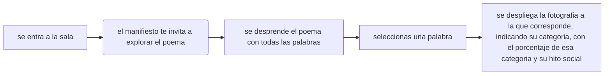

# Taller Visualizacion de Datos

## Hitos Sociales

### ¿Cuáles fueron los principales temas expresados en las redes sociales durante el estallido social y la pandemia?

agregar fotos de hitos*

## Principales diapos

### Adquirir

#### DÓNDE MIRO

Primero definimos cuatro hitos sociales, revolucion pinguina, terremoto, estallido social y pandemia.

Recopilamos mediante búsqueda manual en un tiempo determinado de un año de hito todas sus fotos.

no encontramos publicaciones en las fechas de revolucion pinguina, ni terremoto por lo que descartoamos estos hitos sociales

- Revolución Pingüina: 1 de enero de 2006 – 1 de enero de 2007

- Terremoto: 27 de febrero de 2010 – 27 de febrero de 2011

- Estallido Social: 18 de octubre de 2019 – 18 de octubre de 2020

- Pandemia: 13 de marzo de 2020 – 13 de marzo de 2021

### Analizar

#### ¿QUÉ MIRO?

TRABAJAR ESTA IDEA que existe un que hacer con comunicar temas que van repitiendose, a traves de nuestra observacion definimos las tematicas, variables

La primera variable que definimos fue el período, diferenciando entre el estallido social y la pandemia. 

Posteriormente, definimos las variables que permitieran responder a la pregunta principal sobre los temas manifestados durante cada hito social, estas categorias las utilizamos para organizar, categorizarlas en una tematica.

#### Variables

Período: Estallido social / Pandemia.

Temática: Política, Salud, Humor, Economía, Espiritualidad, cultura y educación.

### Filtrar

#### ¿CÓMO MIRO?

Seleccionamos únicamente las imágenes que contenían texto, ya que este permite identificar de manera explícita la intención del mensaje y proporciona un contexto comunicativo que facilita el análisis, no queremos tener un sessgo por lo que decidimos utilizar ia a categorizar las frases en estos textos.

para esto con una ia extraimos el texto con el cual vamos a trabajar.

Ademas de sacar los conectores.

### Minar

#### ¿QUÉ CREO?

creamos un poema

PORQUE UN POEMA

MANIFESSTACION POLITICA, UNA EXIGENCIA

alejarnos de los academico, dimension sensible

hay un poema desplegado en la proyecto

hay un poema desplegado en la proyecto

hacer que naveguen el parámetro que queremos mostrar

incoehente.

## Interaccion

### Representar

### Afinar

### Interactuar

manifiesto te interesaria saber cuales son las tematicas mas utilizadas, de donde viene esta palabra, jutilizar la erramienta opara no sesgar el analicis, experiencia, primero manifiesto y luego del poema, formas de la imagen texto de la imagen.

porque estoy respondiendo la pregunta atravez de la interaccion.

poner abajo el porcentaje de la categoria

justificar que es un poema, que es incoeherente, 

porque estoy respondiendo la pregunta atravez de la interaccion.

busqueda relacionada

poner en negrita todas las palabras de categoria

## Montaje y elementos

1 infra, edificio: todo lo que soporta el proyecto

2: dispositivos, la tecnica, proyector, pc, i pad

3: mobiliario: lienzo blanco, atril para la tela

---

## Referentes

https://direct.mit.edu/books/edited-volume/5867/OutputAn-Anthology-of-Computer-Generated-Text-1953

alejandra pizarnik

El territorio del viaje, Daniela Catrileo

Mil noches de sudamerica, Alex Anwandter

