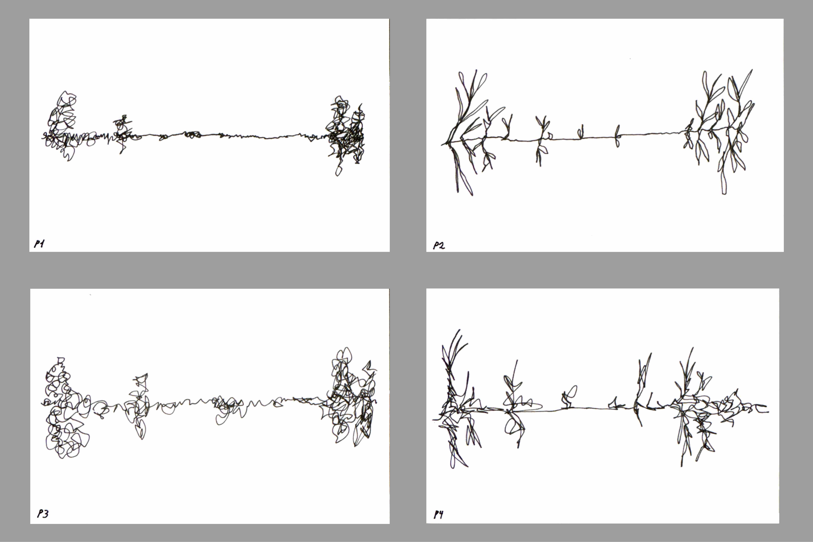
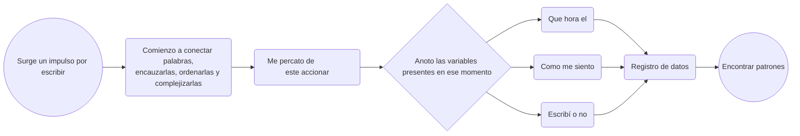
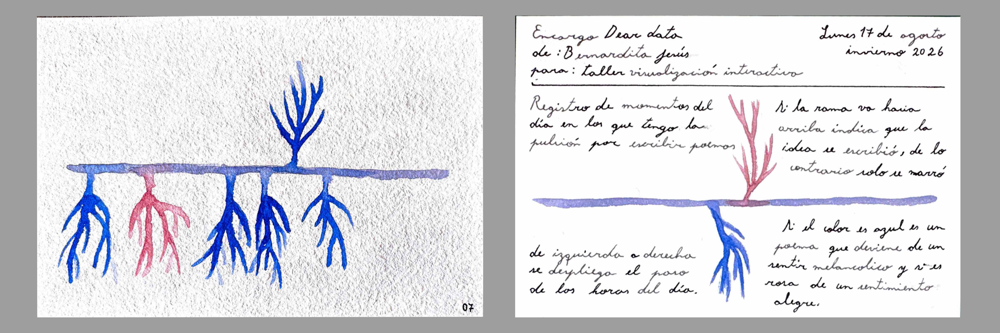
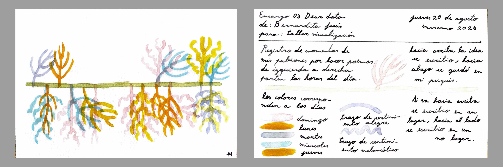
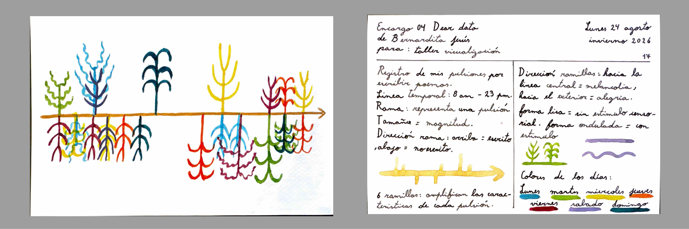

# Escala 01

## Encargo Dear Data

Encargo inspirado en el libro **Dear Data**. Vamos a hacer una lámina de 10 × 15 cm, a modo de postal, en donde por una cara esté la visualización y por la otra, la explicación.

Tenemos que registrar datos de algún **tema o conflicto de interés de nuestra rutina, de nuestro diario vivir**.

Es como una suerte de ejercicio de **autoobservación activa**.

### Propuestas de temas que registrar

Primero hice un listado, en la misma clase, de qué temas podrían llegar a ser de mi interés o se podrían profundizar con supuestas variables.

- Cuánta **influencia tuvo el invierno** en mí, cómo cambia mi manera de relacionarme.

- Cuánto pensé en la estación del año o con cuántas **manifestaciones del invierno me encontré**.

- **Por qué escribo poemas**, qué me despierta esa acción.

- **Cuántas canciones** me recuerdan a ti.

- Y respecto a lo anterior, **qué canciones salto** y por qué.

Dentro de las que me llamaban la atención, sin hacer un proyecto ultra personal o íntimo, me quedé **entre estas dos opciones**.

Primero, me interesaba registrar **cuántas canciones salto y cuántas escucho**, un poco por esta dinámica en la que he estado entrando, en donde muchas canciones me agobian, me remontan y realmente no las elimino, pero sí las salto. Prácticamente, entre diez canciones, debo saltar unas seis. Ahora, si bien es un tema interesante, el registro de esto **implicaría trackearme** de alguna manera que por el momento desconozco, así que esta idea **la deseché por términos prácticos**.

Y por tanto, me quedé con mi segunda idea, de la que estaba dilucidando, que era **por qué escribo poemas**, qué me despierta esa acción. Tal vez pueden ser las horas, mi estado de ánimo, ruidos, colores, pero de alguna parte **surge este impulso por escribir o narrar**, buscar conectar palabras, encauzarlas, ordenarlas, complejizarlas; surge de algún detonante.

Me gustaría, más que nada registrarlo, porque, por supuesto, tengo mis suposiciones que más adelante obviaré.

Me gusta, por sobre todo, esta inquietud, ya que este último tiempo me he dejado fascinar por diferentes **medios de registro**, como la fotografía, los videomontajes, las grabaciones de campo y la escritura. Me he impregnado de estas **prácticas artísticas** que, en definitiva, se convirtieron en un medio de supervivencia.

Y la poesía, que más que una ñoñería por complejizar el lenguaje, o más bien, además de eso, te permite crear obras sumamente personales, narrativas llenas de referencias, interpretaciones y simbologías.

[Adjunto un link a mi repositorio de poemas.](https://github.com/Bernardita-Jesus/poemas-2026)

Yo sé que es un medio de **resistencia para mí**, y que definitivamente, en momentos emocionales intensos, escribir es una manera de resolver una inquietud, conversar con tus ideas, pero me rehúso a solo pensar que deviene de una inestabilidad; quiero **buscar esos elementos que despiertan la sensibilidad en mí**.

### Propuestas de comunicación gráfica

- **Dibujos de ramas**; las ramas con las veces, las hojas o flores podrían representar un sentir.

- **Menos figurativamente**, podría utilizar los colores o incluso la opacidad para representar mi sentir.

En la siguiente foto realicé los primeros **doodles y bocetos**, imaginando cómo podría representar estos datos recopilados.

En la siguiente foto se pueden ver las primeras cuatro iteraciones de cómo podrían visualizarse mis datos en formato postal.

## Primera postal

Si mi día se redistribuyera de manera horizontal, de **izquierda a derecha pasan las horas; cada rama surge como respuesta a un impulso por escribir o narrar**.

**La profundidad del trazo significa la complejidad** y el conflicto de la idea, reforzado por la opacidad. Cuando me refiero a complejidad, aparentemente es justo eso lo que quiero describir; una idea difícil que me pesa. Por esto me parecía bonito utilizar un material expresivo como la acuarela.

En la siguiente imagen se puede ver la **primera entrega** que mencioné anteriormente. Este fue el resultado después de cuatro iteraciones de formas de visualizar los datos recopilados.

### Estrategia de registro

Tal vez, como manera de registro, debería tomar en cuenta cuando surge esta pulsión o **impulso por escribir**, despierta una sensibilidad en mí, y entonces busco conectar palabras, ordenarlas o narrarlas; entonces **me percato de este accionar y lo registro**. 

Y entonces ahí, en ese momento, anoto **qué hora es**, me cuestiono**cómo me siento**, **dónde estoy** y todas esas variables que pueden servir para desarrollarlas y **encontrar patrones**.

De ser al revés, me parecería agobiante; estaría registrando hora a hora, si surge algún impulso por escribir, como anteriormente lo realicé, esto se puede evidenciar en la siguiente foto de mi bitácora.

O peor aún, estar registrando hora a hora cómo me siento, despertando un estado de **hipervigilancia** de mis emociones.

Por tanto, **esta es la estrategia que usaré**:

### Nuevas variables

Luego de recopilar datos del **día domingo 16 de agosto**, puedo darme cuenta de que la manera más cómoda, y desde donde podría utilizar a futuro y seleccionar más variables, es anotar lo siguiente:

Primero que nada, me parece crucial, apenas surge un impulso por escribir, como determiné anteriormente en el diagrama de flujo, anotar **la hora**. Luego, anoto **de qué quiero escribir** y si **escribí o solo me quedé en la idea**; después, **qué estoy haciendo**, luego **dónde estoy** y, por último, **cómo me siento emocionalmente**.

Sin embargo, las **únicas variables que he incorporado** por el momento en la visualización son **la hora, si escribí o no y cómo me siento**.

## Segunda postal

En la siguiente fotografía se puede ver la segunda postal para el **encargo de Dear Data**, la cual es el registro de los momentos del día, en este caso del domingo 16, en donde me surgió el impulso por hacer poemas.

De **izquierda a derecha se despliegan las horas del día**, de donde surgen las ramas, que **marcan la hora del día**. Estas ramas indican **cuándo fueron esos impulsos** por hacer poemas; si la **rama crece hacia arriba**, significa que la idea fue escrita de manera física y tangible; de lo contrario, si la **rama crece hacia abajo** solo se llegó a la concepción de narrarla, de conectar palabras y encauzarlas en mi psiquis. Si el **color es azul**, es un poema o una idea que deviene de un sentimiento melancólico, y **si es rosa**, de un sentimiento alegre.

### Corrección segunda postal

[Guillermo](https://github.com/guillemontecinos) me manifestó, que intentara no perder la visualidad, la riqueza material de la acuarela con las reglas del sistema.

### Información en las ramas

Me parece importante agregar, en la simbología de las ramas, formas que hagan referencia al lugar en el que estaba, ya que he encontrado un patrón: suelo escribir, en su mayoría, en lugares de transición.

Podría determinar estas dos variables: si estoy en un lugar de residencia o si estoy en un espacio de transición o medio de transporte.

### Escalar

**Escalar a más datos**

Sergio Mora-Díaz me consultó cómo pensaba **visualizar datos de más de un día**. A mí me parece importante **conservar los datos por día**, ya que los momentos de cada uno son relevantes dentro del registro. He encontrado la **conclusión preliminar** de que es durante las mañanas y en la tarde-noche cuando más escribo.

Es por esto que mi propuesta para una mayor escala, es crear una **suerte de bosque lleno de árboles correspondientes a cada día**, y cambiar el formato **horizontal a vertical**. Esto también implicaría replantearme los **simbolismos direccionales** de las ramas, para que calcen con esta nueva visualidad.

**Escalar a formato digital**

Mientras mencionaban la posibilidad de tener que escalar estos datos, megadatos, los cuales yo estoy anotando en un diario, y debíamos pasarlos a formato digital, pensé que sería muy interesante **realizarlo en p5.js** y crear este bosque que mencionaba.

Voy a trabajar en un **seudocódigo** para crear un proyecto en p5.js.

Sergio Mora-Díaz agregó que algo interesante y aprovechable de trabajar con formatos digitales es que podemos trabajar con una **tercera dimensión o trabajar con el tiempo**, podrían surgir y crecer cosas, permitiendo ver esa **línea de tiempo en vivo**.

## Tercera postal

## Cuarta postal

