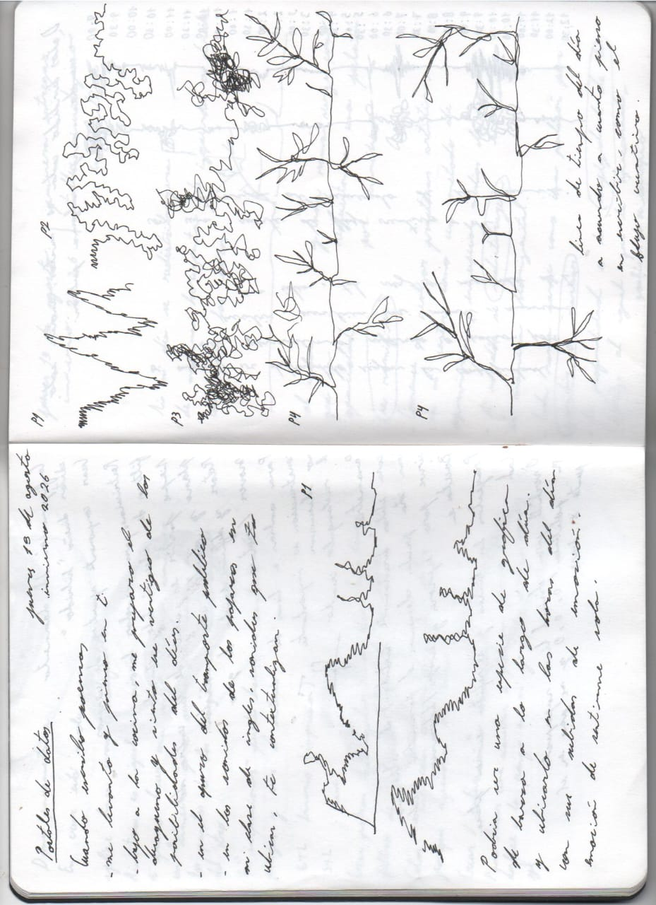
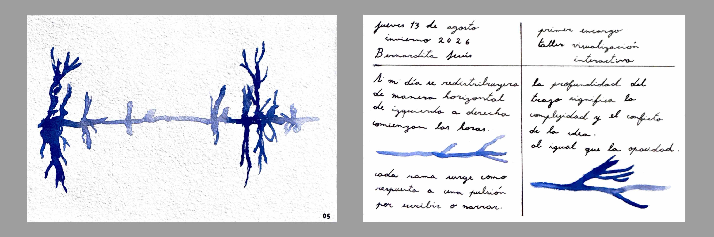
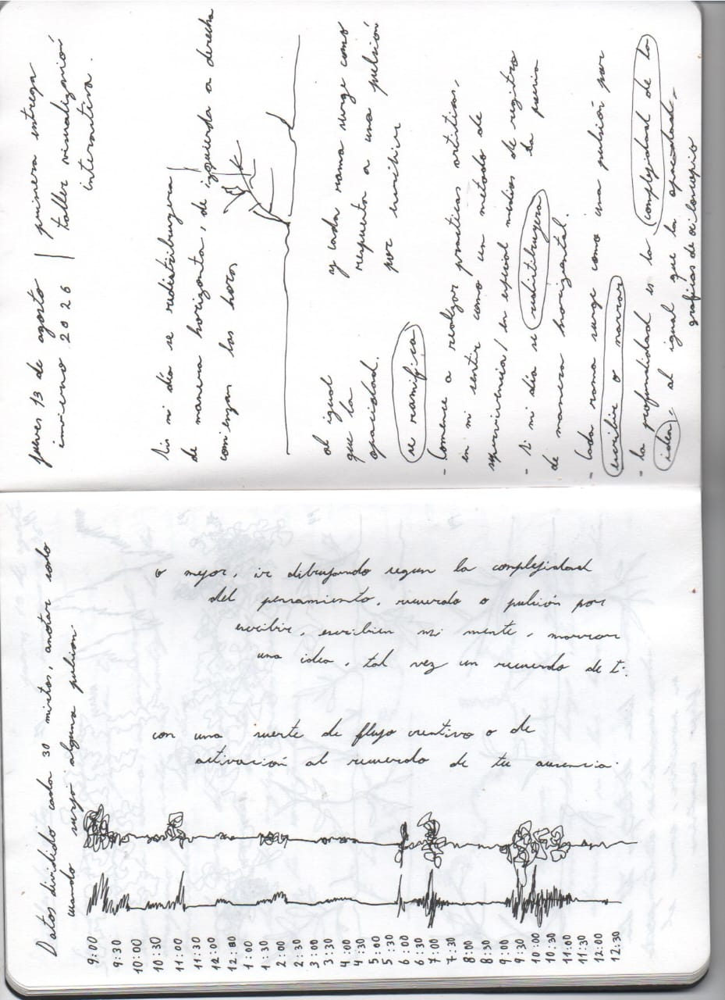
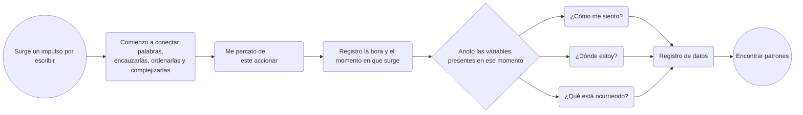

# Escala 01

## Registrar

Encargo inspirado en el libro **Dear Data**. Vamos a hacer una lámina de 10 × 15 cm, a modo de postal, en donde por una cara esté la visualización y por la otra, la explicación.

Tenemos que registrar datos de algún **tema o conflicto de interés de nuestra rutina, de nuestro diario vivir**.

Es como una suerte de ejercicio de **autoobservación activa**.

## Encargo 01

Primero hice un listado, en la misma clase, de qué temas podrían llegar a ser de mi interés o se podrían profundizar con supuestas variables.

**Propuestas de temas que registrar:**

- Cuánta **influencia tuvo el invierno** en mí, cómo cambia mi manera de relacionarme.

- Cuánto pensé en la estación del año o con cuántas **manifestaciones del invierno me encontré**.

- **Por qué escribo poemas**, qué me despierta esa acción.

- **Cuántas canciones** me recuerdan a ti.

- Y respecto a lo anterior, **qué canciones salto** y por qué.

Dentro de las que me llamaban la atención, sin hacer un proyecto ultra personal o íntimo, me quedé **entre estas dos opciones**.

Primero, me interesaba registrar **cuántas canciones salto y cuántas escucho**, un poco por esta dinámica en la que he estado entrando, en donde muchas canciones me agobian, me remontan y realmente no las elimino, pero sí las salto. Prácticamente, entre diez canciones, debo saltar unas seis. Ahora, si bien es un tema interesante, el registro de esto **implicaría trackearme** de alguna manera que por el momento desconozco, así que esta idea **la deseché por términos prácticos**.

Y por tanto, me quedé con mi segunda idea, de la que estaba dilucidando, que era **por qué escribo poemas**, qué me despierta esa acción. Tal vez pueden ser las horas, mi estado de ánimo, ruidos, colores, pero de alguna parte **surge este impulso por escribir o narrar**, buscar conectar palabras, encauzarlas, ordenarlas, complejizarlas; surge de algún detonante.

Me gustaría, más que nada registrarlo, porque, por supuesto, tengo mis suposiciones que más adelante obviaré.

Me gusta, por sobre todo, esta inquietud, ya que este último tiempo me he dejado fascinar por diferentes **medios de registro**, como la fotografía, los videomontajes, las grabaciones de campo y la escritura. Me he impregnado de estas **prácticas artísticas** que, en definitiva, se convirtieron en un medio de supervivencia.

Y la poesía, que más que una ñoñería por complejizar el lenguaje, o más bien, además de eso, te permite crear obras sumamente personales, narrativas llenas de referencias, interpretaciones y simbologías.

Yo sé que es un medio de **resistencia para mí**, y que definitivamente, en momentos emocionales intensos, escribir es una manera de resolver una inquietud, conversar con tus ideas, pero me rehúso a solo pensar que deviene de una inestabilidad; quiero **buscar esos elementos que despiertan la sensibilidad en mí**.

### Propuestas de comunicación gráfica

- **Dibujos de ramas**; las ramas con las veces, las hojas o flores podrían representar un sentir.

- **Menos figurativamente**, podría utilizar los colores o incluso la opacidad para representar mi sentir.

En la siguiente foto realicé los primeros **doodles y bocetos**, imaginando cómo podría representar estos datos recopilados.

## Primera postal

En la siguiente imagen se puede ver la **primera entrega** que mencioné anteriormente. Este fue el resultado después de cuatro iteraciones de formas de visualizar los datos recopilados.

### Propuestas de nuevas variables

Tal vez, como manera de registro, debería tomar en cuenta cuando surge esta pulsión o **impulso por escribir**, despierta una sensibilidad en mí, y entonces busco conectar palabras, ordenarlas o narrarlas; entonces **me percato de este accionar y lo registro**. 

Y entonces ahí, en ese momento, anoto **qué hora es**, me cuestiono**cómo me siento**, **dónde estoy** y todas esas variables que pueden servir para desarrollarlas y **encontrar patrones**.

De ser al revés, me parecería agobiante; estaría registrando hora a hora, como anteriormente lo realicé, si surge algún impulso por escribir en mí, o peor aún, hora a hora estar registrando cómo me siento, despertando un estado de **hipervigilancia** de mis emociones.

Por tanto, **esta es la estrategia que usaré**:

