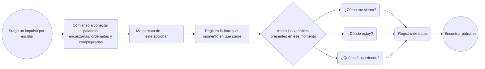

# Escala 01

## Registrar

Encargo inspirado en el libro **Dear Data**. Vamos a hacer una lámina de 10 × 15 cm, a modo de postal, en donde por una cara esté la visualización y por la otra, la explicación.

Tenemos que registrar datos de algún **tema o conflicto de interés de nuestra rutina, de nuestro diario vivir**.

Es como una suerte de ejercicio de **autoobservación activa**.

## Encargo 01

primero hice un listado en la misma clase de que temas podria llegar a ser de mi interes o se podrian profundizar con supuestas variables.

**Propuestas de temas que registrar:**

- Cuánta influencia tuvo el invierno en mí, como cambia mi manera de relacionarme.

- Cuánto pensé en la estación del año o con cuantas manifestaciones del invierno me encontre.

- **por qué escribo poemas que me despierta esa accion**.

- Cuántas canciones me recuerdan a ti.

- y respecto a lo anterior, que canciones salto y por que.

dentro de las que me llamaba la atención, sin hacer un proyecto ultra personal o intimo, me quede entre estas dos opciones; 

primero me interezaba registrar cuantas canciones salto, y cuantas escucho, un poco por esta dinámica en la que he estado entrando en donde muchas canciones me agobian, me remontan y realmente no las elimino, pero si las salto, practicamente entre dies canciones debo saltar unas seis. ahora, si bien es un tema interezante, el registro de esto impricacia crakearme de alguna manera que por el momento desconozco, asi que esta idea la deseche por terminos practicos.

y por tanto, me quede con mi segunda idea de la que estaba dilucidando, que era por qué escribo poemas que me despierta esa accion, tal vez pueden ser las horas, mi estado del animo, ruidos, colores, pero de alguna parte surge este impulso por escribir o narrar, buscar conectar palabras, encausarlas, ordenarlas, complejizarlas; surge de algun detonante.

Me gustaria mas que nada registrarlo; porque por su puesto que tengo mis suposiciones, que mas adelante obviare.

me gusta por sobre todo esta inquietud, ya que este ultimo tiempo me he dejado fascinar por diferentes medios de registro como la fotografía, los video montajes, las grabaciones de campo, la escritura, me he impregnado de estas practicas artísticas que en definitiva se convirtieron en un medio de supervivencia. y la poesía, que mas que una ñoñería, por complejizar el lenguaje, además de eso, te permite crear obras sumamente personales, narrativas que llenas de referencias y interpretaciones y simbologia.

yo se que es un medio de resistencia para mi, y que definitivamente en momentos emocionales intensos, escribir es una manera de resolver una inquietud, conversar con tus ideas, pero me reúso a solo pensar que deviene de una inestabilidad; quiero buscar esos elementos que despiertan la sensibilidad en mi.

### Propuestas de comunicación gráfica

- Dibujos de ramas; las ramas con las veces, las hojas o flores podrían representar un sentir.

- Menos figurativamente, podría utilizar los **colores o incluso la opacidad** para representar mi sentir.

agregar fotos 

en la siguiente foto realice los primeros duruls y bocetos, imaginando como podría representar estos datos recopilados del

## primera postal

en la siguiente imagen se pueden ser la primera entrega que mencioné anteriormente, este fue el resultado despues de cuatro iteraciones de formas de visualizar los datos recomilados a lo largo 

### Propuestas de nuevas variables

Tal vez, como manera de registro, debería anotar; surge esta pulsión o **impulso por escribir**, despierta una sensibilidad en mí, busco conectar palabras, encausarlas, ordenarlas, complejizarlas; entonces **me percato de este accionar y lo registro**. Y entonces ahí, en ese momento, anoto **qué hora es**, me cuestiono**cómo me siento**, **dónde estoy** y todas esas variables que pueden servir para desarrollarlas y **encontrar patrones**.

De ser al revés, me parecería agobiante; estaría registrando hora a hora, como anteriormente lo intenté, si surge algo en mí, y peor aún, hora a hora cómo me siento, despertando un estado de **hipervigilancia** de mis emociones.

Por tanto, **esta es la estrategia que usaré**:

