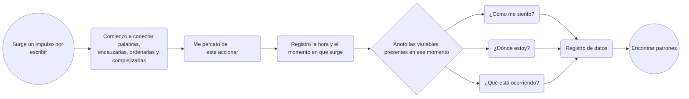

# Escala 01

## Registrar

Encargo inspirado en el libro Dear Data. Vamos a hacer una lámina de 10 × 15 cm, a modo de postal, en donde por una cara esté la visualización y por la otra, la explicación.

Tenemos que registrar datos de algún tema o conflicto de interés de nuestra rutina, de nuestro diario vivir.

Es como una suerte de ejercicio de autoobservación activa.

### Ideas de registro

- Cuánta influencia tuvo el invierno en mí.

- Cuánto pensé en la estación del año.

- Cuánto pensé en ti.

- Cuánto escribo de lo que siento.

- Cuántas canciones me recuerdan a ti.

### Ideas de comunicación gráfica

- Dibujos de ramas; las ramas con las veces, las hojas o flores podrían representar un sentir.

- Menos figurativamente, podría utilizar los colores o incluso la opacidad para representar mi sentir.

 ### Posibles variables

Tal vez, como manera de registro, debería anotar: surge esta pulsión por escribir, despierta una sensibilidad en mí, busco conectar palabras, encausarlas, ordenarlas, complejizarlas; entonces me percato de este accionar y lo registro. Y entonces ahí, en ese momento, me cuestiono cómo me siento, dónde estoy, qué hora es, y todas esas variables que pueden servir para desarrollarlas y encontrar patrones.

De ser al revés, me parecería agobiante; estaría registrando hora a hora, como anteriormente lo intenté, si surge algo en mí, y peor aún, hora a hora cómo me siento, despertando un estado de hipervigilancia de mis emociones.

Por tanto, está en la estrategia que usaré:

